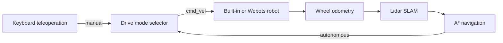

# Keyboard, waypoint missions and Webots

Restart the backend and frontend after this update. These projects use the same
odometry, lidar SLAM, navigation, command selector and Rerun plugins.

Start the backend from the repository root without automatic reload:

```powershell
.\.venv\Scripts\python.exe -m uvicorn backend.app.main:app --port 8000
```

Do not use an unrestricted `--reload`: starting Webots generates a Python
controller under `artifacts/webots`, which the reloader treats as a source change.
It can restart the backend and immediately shut down the simulator. Restart the
backend manually after editing its source code.

| Project | Simulator | Initial drive mode |
| --- | --- | --- |
| `teleoperation.pyrobot.json` | Built-in geometric simulation | Stopped |
| `webots.pyrobot.json` | Webots wheel physics, lidar, camera and encoders | Stopped |

## Drive with the keyboard

1. Open either project in Studio and click **Start Graph**.
2. Wait for the measured map; Webots may take longer to launch initially.
3. Select **Manual** in the map/control panel beside Rerun.
4. Click the **Keyboard driving** pad to give it focus.
5. Hold W/up to drive forward, S/down to reverse, A/left or D/right to turn.
   Combining forward and turn keys drives an arc. Space commands zero velocity.
6. Releasing the keys, leaving the pad or switching tabs stops manual motion.
   **Stop** selects a persistent stopped mode while sensors and mapping continue.

Only one browser tab can own a keyboard node at a time. The browser sends
heartbeats; the keyboard node outputs zero after 0.3 seconds without fresh keys.
The selector discards cached commands on mode changes and stops if its selected
source stops publishing. There is no automatic fallback from manual to autonomy.

The command graph is:



To add these controls to an older graph, remove its direct navigation-to-simulator
wire and insert the selector. Both selector inputs are required. Templates
already contain the correct wiring.

## Place waypoints on the SLAM map

The interactive map beside the embedded Rerun viewer uses the measured SLAM
occupancy grid, not the simulator's hidden world geometry. The Rerun canvas itself
is a visualization; place waypoints on the adjacent **SLAM waypoints** map.

- Click to add numbered destinations in order. Black occupied cells reject clicks.
  Gray unknown cells are allowed, so a robot can explore toward them.
- Use **Undo point** to remove the last draft destination.
- Click **Run waypoints** to apply the queue and select autonomous mode.
- The robot plans to each point in sequence and stops at the last one with
  `mission_complete`. Completion remains latched until a new mission is applied.
- **Clear waypoints** stops motion and clears the active queue.
- The X/Y **Navigate** button replaces the mission with a single coordinate goal.
- **Pause motion** stops movement; **Resume motion** resumes autonomous navigation.

Draft clicks do not immediately command motion. **Run waypoints** applies them to
the navigation node's `waypoints` parameter. **Save project** preserves the
applied queue, not unsent draft edits. Restarting the graph restarts mission
progress. `no_path` means the measured map currently has no route, including when
a goal is too close to an obstacle after clearance inflation; move the waypoint
or map more of the room manually. Manual mode pauses waypoint progression.

The panel explains stops caused by blocked routes, close obstacles, missing
sensor updates, or a completed mission. Commands continue between map updates,
but navigation stops after 1.5 seconds without a fresh observation. SLAM keeps
up to 64 spatial keyframes and matches against nearby anchors when revisiting
areas; this improves local stability but is not global loop closure. Map cells
still update when new measurements contradict old observations.

## Run Webots

Webots R2025a was installed into this workspace's `.tools/Webots` directory for
verification. This installation is local, ignored by Git, and not bundled in
project exports. On another computer, install Webots and either let detection
find it or set the Webots node's `executable` parameter / `WEBOTS_EXECUTABLE`.

Open `webots.pyrobot.json` and start the graph. The Webots node generates a fresh
offline world under `artifacts/webots/<run>/worlds/pyrobot.wbt` and launches it.
Its log is `artifacts/webots/<run>/webots.log`. The world uses configured room
bounds, obstacle boxes, wheel joints, sensor mounts and the URDF base box.
There are no external PROTO or texture downloads.

The generated overview camera faces the centre of the configured room. After
updating the exporter/controller, stop and restart the graph to generate a new
world; an already-open world retains its previous camera and sensor settings.

Keep Webots running in real-time mode. Drive and set goals through Studio.
**Stop Graph** shuts down the controller and the simulator launched by that node;
it does not close unrelated Webots sessions. Start again to reset the world/map.
Resetting the world directly in Webots while the graph is running is unsupported:
the adapter detects a backwards simulation clock and asks for a graph restart.

The controller obtains lidar ranges, camera pixels and wheel encoder positions
from Webots devices. Ground-truth pose goes only to visualization. SLAM and
navigation still consume sensor measurements. Unlike the built-in simulator,
Webots computes wheel contacts and body dynamics; the estimator and planner
remain planar, and this exporter currently supports the configured four-wheel
differential robot with an axis-aligned box body and level sensors.

The adapter/control link is localhost-only with a per-run token, bounded packets
and timeouts. It is an internal simulator protocol, not a remote deployment API.

## Verify

```powershell
.\.venv\Scripts\python.exe tests/run_all.py
.\.venv\Scripts\python.exe tests/browser_simulation.py
.\.venv\Scripts\python.exe tests/webots_smoke.py
.\.venv\Scripts\python.exe tests/webots_mapping_smoke.py
```

The browser test requires Playwright and Microsoft Edge. The optional Webots test
launches a minimized physics simulator, checks sensor axes, drives forward,
checks stopping after keyboard release, navigates two waypoints and checks
process cleanup. It is separate from the default suite because it requires a
working Webots installation and graphics support.

Implementation references: [Webots lidar API](https://github.com/cyberbotics/webots/blob/R2025a/docs/reference/lidar.md),
[camera API](https://github.com/cyberbotics/webots/blob/R2025a/docs/reference/camera.md),
and [controller configuration](https://github.com/cyberbotics/webots/blob/R2025a/docs/guide/controller-programming.md).
