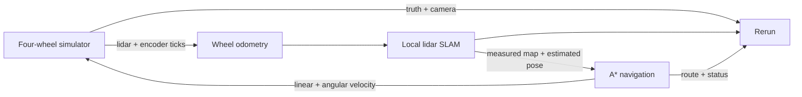

# Four-wheel navigation reference

For **keyboard driving, clickable waypoint missions and Webots physics**, use
[the controls and Webots guide](CONTROLS_AND_WEBOTS.md). The original
`navigation.pyrobot.json` remains the automatic built-in demonstration.

A runnable Studio project with a four-wheel URDF, simulated 360-degree lidar,
camera and encoders, local lidar SLAM, A* planning and closed-loop navigation.
Motion is planar within a 3D room; this built-in simulator needs no Webots.

## Run in Studio

Restart any existing backend so it discovers the new plugins. From the repository
root, in PowerShell:

```powershell
.\.venv\Scripts\python.exe -m uvicorn backend.app.main:app --port 8000
```

In a second terminal:

```powershell
cd frontend
npm.cmd run dev
```

Open the address printed by Vite (normally http://localhost:5173).

1. Choose **Open project**, then `examples/four-wheel/navigation.pyrobot.json`.
2. Choose **Start Graph**. The robot begins navigating toward (8, 6) metres.
3. The embedded Rerun viewer shows the robot and room, lidar returns, estimated
   trajectory, planned route, simulated camera, occupancy map and status.
4. Enter **Goal X** and **Y**, then **Navigate** to change the destination.
   **Pause motion** stops commands; resume continues toward the goal.
5. Use **Open Rerun** for a larger view, or **Hide 3D** for more graph space.
   Rerun must be playing at the live end of its timeline to show current motion.
6. Stop and start the graph to reset the robot, encoders and map. Save project
   preserves configuration and URDF, not the live map or robot position.

If dependencies are missing, install `requirements.txt` into your Python
environment and run `npm.cmd install` in `frontend` first.

## Run without Studio

Stop the Studio backend first: both own the default local bus ports.

```powershell
.\.venv\Scripts\python.exe -m core.runtime validate examples/four-wheel/navigation.pyrobot.json
.\.venv\Scripts\python.exe -m core.runtime run examples/four-wheel/navigation.pyrobot.json --viz
```

Open the viewer URL printed by the runner. Ctrl+C stops the project.
Add `--duration 60` for a bounded run. Without `--viz`, navigation still runs.

## How it works



Ground truth and room geometry feed visualization only. The estimator uses
encoders and lidar; the planner uses the measured occupancy map. Unknown map
cells have a higher traversal cost. Obstacles are inflated for robot clearance;
front lidar stopping and a 0.6-second command expiry limit simulated motion.
Navigation also sends zero velocity and reports `sensor_timeout` after 1.5 wall
seconds without an advancing sensor timestamp. Repeated or older observations
cannot keep it active. Fresh observations resume navigation if enabled; Pause
sends zero velocity immediately, even with no sensor input. A graph restart
resets the timestamp tracking when restarting the simulator.
`no_path` means the current measured map has no traversable route; navigation
retries as the map changes. Try a reachable goal if it persists.

The robot uses 0.12 m wheels, 0.62 m track, four 4096-tick encoders, 360 lidar
beams at 10 Hz with a 9 m range, and a 240 x 144 geometric camera at 5 Hz.
The default encoder bias deliberately introduces odometry drift. Change that
parameter while stopped; simulator speed can be changed while running.

`robot.urdf` defines the body, wheel joints, sensor mounts and encoder frames.
The project embeds the same URDF, so opening it requires no separate upload.
Editing the standalone URDF does not change the embedded copy: upload your
modified URDF in Studio while stopped, then save the project.

## Adapt it to another robot

| Location | Responsibility |
| --- | --- |
| `core/simulation/world.py` | Room, ray casting, camera and planar drive model |
| `core/simulation/navigation.py` | Encoder integration, local ICP SLAM, occupancy mapping, A* and route following |
| `plugins/user/four_wheel_sim.py` | Simulator bus interface and command expiry |
| `plugins/user/wheel_odometry.py` | Sensor packet to odometry observation |
| `plugins/user/lidar_slam.py` | Mapping worker |
| `plugins/user/astar_navigation.py` | Goal parameters and navigation worker |
| `plugins/user/simulation_view.py` | Rerun scene, URDF rendering and status |

Duplicate the project, change the URDF and goals, then save under a new name.
While stopped, use **Robot configuration** to select wheel joint names, sensor
frames, drive dimensions, room geometry and occupancy-map settings. These are
included in project schema version 2; version 1 imports use the original defaults.
The simulator supports four-wheel differential drive and explicitly rejects
unsupported geometry. See [runtime configuration](../../docs/RUNTIME_HARDENING.md).
A hardware/Webots
adapter can replace the simulator while retaining the downstream graph if it
publishes the same sensor packet and consumes `{linear, angular}` commands
(metres/second and radians/second). Match units, wheel order, frame conventions,
scan timing and encoder calibration; this is not automatic hardware support.

## Scope and verification

This is local planar lidar SLAM using point-to-plane ICP and encoder prediction,
with occupancy mapping. It has no global loop closure or saved-map localization.
The camera is a geometric visualization, not photorealistic input or visual SLAM.
There is no suspension, traction, wheel-slip physics or terrain dynamics.
These simulated stopping mechanisms are not hardware safety certification.

Run `python tests/run_all.py` for the regression suite. The new simulation tests
exercise transforms, sensor geometry, collision detection, obstacle-aware A*,
sensor-only closed-loop arrival and real-bus/Rerun integration. An optional
`python tests/browser_simulation.py` smoke test uses Playwright and installed
Microsoft Edge, starts isolated servers and saves a screenshot under `artifacts`.
